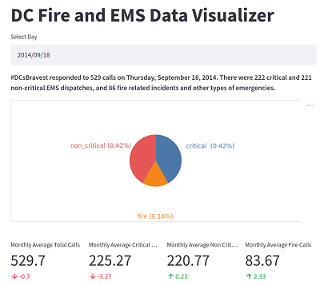

# DC Fire and EMS Data Visualizer

This project uses [Streamlit](https://streamlit.io/) to display the DC Fire and EMS call volume between August 2014 through August 2015. The data is being stored in a a MongoDB time series collection. This project was built for the [MongoDB Atlas Hackathon](https://dev.to/devteam/announcing-the-mongodb-atlas-hackathon-on-dev-4b6m)]

> 
